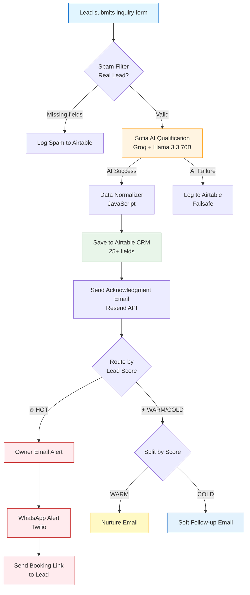

# Sofia AI —Lead Qualification Workflow

An end-to-end AI-powered lead qualification and nurture system built in n8n for US-based MedSpa & aesthetic clinics.

When a lead submits an inquiry, **Sofia** (an AI receptionist) qualifies them in under 5 seconds — 24/7 — and routes them to the right action automatically. No leads lost. No delays. No manual triage.

---

## 🎯 Why This Matters

MedSpa clinics lose 40-60% of leads simply because nobody responds within the first 5 minutes. Sofia solves this by:

- Replying to every inquiry instantly with personalized AI responses
- Scoring leads as HOT / WARM / COLD using LLM-based intent analysis
- Alerting the clinic owner via WhatsApp the moment a HOT lead arrives
- Logging everything to a structured CRM with consent and compliance fields

---

## 🔥 Key Features

- **AI Lead Scoring** — HOT / WARM / COLD classification using Groq + Llama 3.3 70B
- **Multilingual** — Auto-detects English, Spanish, and Spanglish; replies in the dominant language
- **Smart Routing** — HOT leads alert the owner via WhatsApp; WARM/COLD enter automated nurture sequences
- **Airtable CRM** — 25+ fields tracked per lead, including consent timestamps, dedup hash, and follow-up stage
- **Failsafe Design** — try/catch logic ensures no lead is ever lost, even if the AI call fails
- **Compliance Ready** — PHI flag, consent logging, IP capture, opt-out tracking

---

## 🛠️ Tech Stack

| Layer | Tool |
|-------|------|
| Workflow orchestration | n8n (self-hosted) |
| AI qualification | Groq API (Llama 3.3 70B) |
| CRM database | Airtable |
| WhatsApp alerts | Twilio |
| Transactional email | Resend |

---

## 🚀 Setup Instructions

1. Import `Sofia_Lead_Workflow.json` into your n8n instance
2. Add credentials for Groq, Airtable, Twilio, and Resend
3. Replace placeholders — Update API keys, email, phone, and Airtable Base IDs
4. Set up Airtable schema with required fields
5. Activate the workflow and copy the webhook URL

---

## 👤 Author

**Nafees Ur Rehman** — AI Automation Specialist  
🌐 [huna.pk](https://huna.pk)

Built as part of huna.pk's MedSpa automation service offering — combining AI workflows with social media marketing for aesthetic clinics in the US, UK, and Canada.

---
---

## 📊 Workflow Architecture

### Flow Explanation

1. **Entry Point** — A lead form (website or landing page) hits the n8n webhook
2. **Spam Filter** — Validates that name, email, and phone are present (rejects bots and incomplete submissions)
3. **AI Qualification** — Sofia (powered by Groq + Llama 3.3 70B) analyzes the message and assigns a HOT/WARM/COLD score with reasoning
4. **Failsafe Handling** — If the AI call fails for any reason, the lead is still logged so nothing is lost
5. **CRM Storage** — Every lead is saved to Airtable with 25+ structured fields (consent, dedup hash, follow-up stage, etc.)
6. **Smart Routing** — HOT leads trigger an immediate WhatsApp alert to the clinic owner; WARM/COLD leads enter automated email nurture sequences

---

## 🖼️ Workflow Screenshot

*Full Sofia workflow as built in n8n — 18 nodes orchestrating lead capture, AI qualification, CRM storage, and multi-channel routing.*
## 📄 License

MIT License — feel free to fork, learn, and adapt.
